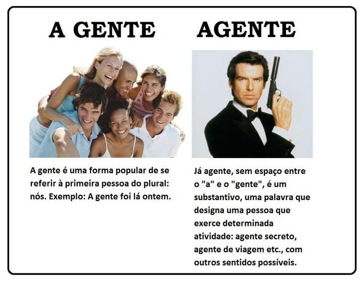
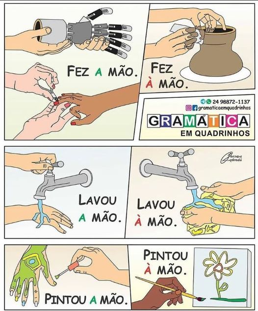

# Ortografia - Dicas de ortografia

- REJUVELHECER :x:    REJUVENESCER :heavy_check_mark:
- FARAM :x:           FARÃO :heavy_check_mark:
- A VISTA :x:         À VISTA :heavy_check_mark:
- CIDADÕES :x:        CIDADÃOS :heavy_check_mark:
- PARALIZAR :x:       PARALISAR :heavy_check_mark:
- AMINÉSIA :x:       AMNÉSIA :heavy_check_mark:

## Sessão x Seção x Secção x Cessão

- Sessão: Espetáculo, cerimônia, apresentação
- Seção: O mesmo que Secção. "Visitei a seção de presentes".
- Secção: Departamento, divisão, setor.
- Cessão: verbo ceder, doar, dar.

## Sob x Sobre

Sobre - Em cima

Sob - abaixo de, Protegido por

## Vim / Vir

#### Errado

"João vai vim de ônibus para o trabalho?"

#### Certo

"Tem como você vir mais cedo?"

#### Por quê?

O verbo vir se refere ao ato de chegar, comparecer, retornar, resultar, etc. O uso de vim só deve ser aplicado na conjugação da primeira pessoa do singular do Pretérito Perfeito.

Ex: "Eu vim para o curso hoje a pé."

## Senão x se não

Senão - caso contrário -> Ela teve que correr, senão perderia a prova

Se não - condição - Se não nevar, podemos visitá-lo.

## Ascender x Acender

Ascender -> Subir, elevar-se
(Ana ascendeu ao cargo de diretora da empresa)

Acender -> Pôr fogo
(Ana acendeu a fogueira)

## Mau x Mal / Bom x Bem

## A gente x Agente

## Crase

# Pontuação 

## Depois de dois-pontos [ : ] se privilegia o uso da letra minúscula.

Dois-pontos é um sinal de pontuação interna. Não termina a frase, apenas introduz uma nova informação. É usado para assinalar uma pequena pausa numa frase que não está concluída.

## Vírgula antes do 'E'?

Ana passou em engenhaira, e Mariana está cursando matemática

Mudou o sujeito? Então usa-se virgula
