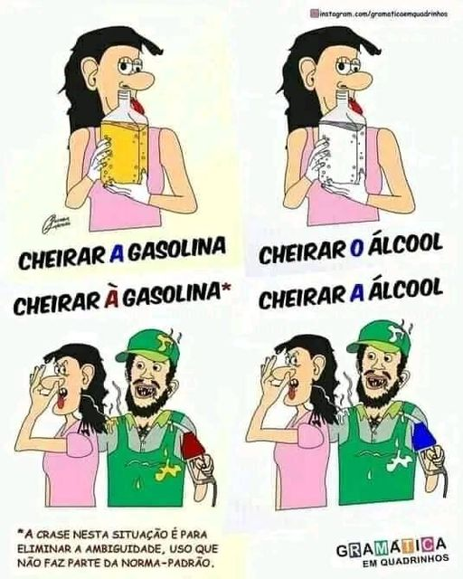
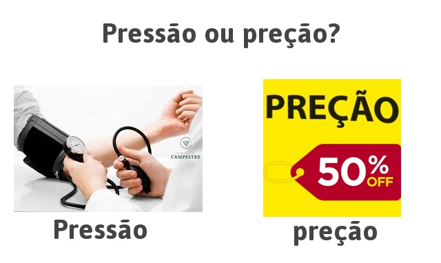
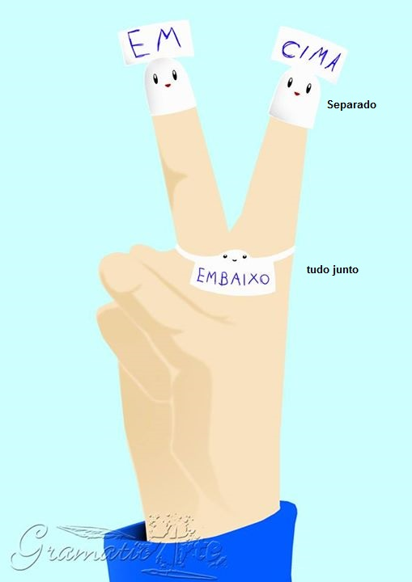
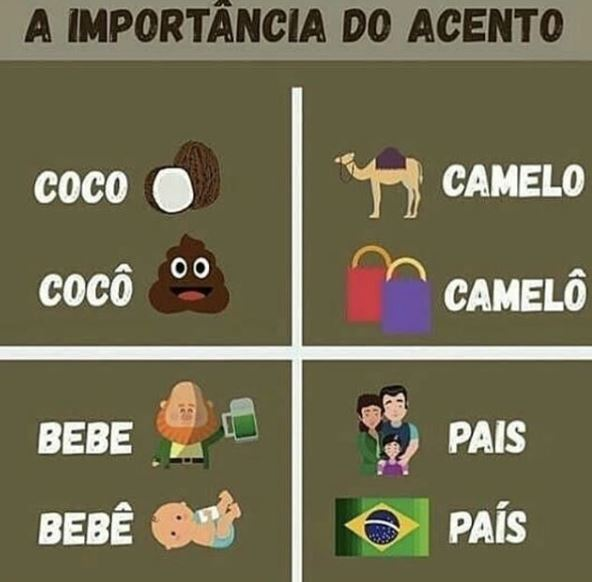

# À mesa x Na mesa x A mesa

- À mesa: ação de estar ou sentar-se para comer
- Na mesa: para indicar algo localizado ou colocado sobre a mesa
- A mesa: Refere-se ao objeto "mesa" 

# Em condicional x incondicional

- Amor em condicional: depende de certas condições ou comportamentos específicos
- Amor incondicional: não depende de nenhuma condição ou expectativa para existir

# Dicas

- Bater à porta: Significa bater para que alguém abra a porta
- Bater a porta: Significa fechar a porta com força
- Bater na porta: Significa dar pancadas na porta, para arrombar a porta.

# Não erre mais:

- Pernicioso: prejudicial
- Aurora: nascer do sol
- Contumaz: persistente
- Dilapidar: desperdiçar;
- Eclético: que seleciona o melhor em diferentes estilos ou ideias
- Fugaz: que passa rapidamente
- Idílico: extremamente feliz

# Ortografia - Dicas de ortografia

- REJUVELHECER :x:    REJUVENESCER :heavy_check_mark:
- FARAM :x:           FARÃO :heavy_check_mark:
- A VISTA :x:         À VISTA :heavy_check_mark:
- CIDADÕES :x:        CIDADÃOS :heavy_check_mark:
- PARALIZAR :x:       PARALISAR :heavy_check_mark:
- AMINÉSIA :x:       AMNÉSIA :heavy_check_mark:

- MENDINGO :x:       MENDIGO :heavy_check_mark:
- REINTERAR :x:      REITERAR :heavy_check_mark:
- GRATUÍTO :x:       GRATUITO :heavy_check_mark:
- FREIAR :x:         FREAR :heavy_check_mark:
- SOMBRANCELHA :x:       SOBRANCELHA :heavy_check_mark:
- BANDEIJA :x:       BANDEJA :heavy_check_mark:
- ADEVOGADO :x:       ADVOGADO :heavy_check_mark:

## Sessão x Seção x Secção x Cessão

- Sessão: Espetáculo, cerimônia, apresentação (Sessão de cinema)
- Seção: O mesmo que Secção. "Visitei a seção de presentes". (seção de laticínios)
- Secção: Departamento, divisão, setor.
- Cessão: verbo ceder, doar, dar. (cessão de direitos)

## Acerca de x A cerca de x Há cerca de x A cerca

- Acerca de: sobre

- A cerca de: perto de

- Há cerca de: tempo decorrido

- A cerca: o cercado

## Sob x Sobre

Sobre - Em cima

Sob - abaixo de, Protegido por

## Suar x Soar

Suar - Transpirar

Soar - Produzir som

## Incipiente x Insipiente

Incipiente - Iniciante, que está no começo

Insipiente - Ignorante, insensato, que não sabe.

## Vim / Vir

#### Errado

"João vai vim de ônibus para o trabalho?"

#### Certo

"Tem como você vir mais cedo?"

#### Por quê?

O verbo vir se refere ao ato de chegar, comparecer, retornar, resultar, etc. O uso de vim só deve ser aplicado na conjugação da primeira pessoa do singular do Pretérito Perfeito.

Ex: "Eu vim para o curso hoje a pé."

## Senão x se não

Senão - caso contrário, "a não ser" -> Ela teve que correr, senão perderia a prova

Se não - condição - Se não nevar, podemos visitá-lo.  (Se não é usado nas orações subordinadas condicionais. Ex: "Se não chover, poderemos sair.")

Errado

"Nada fazia se não reclamar."

Certo

"Nada fazia senão reclamar."

Por quê?

Senão significa "a não ser", "caso contrário".
Se não é usado nas orações subordinadas condicionais.

Ex: "Se não chover, podemos sair."

## Haja x Aja

- Haja (verbo haver)
Ex: Haja paciência!

- Aja (verbo agir)
Ex: Aja com paciência

## Enfim x Em fim

Enfim: Afinal, finalmente (Ex: Enfim estamos juntos!)

Em fim: No fim (Ex: Ela está em fim de carreira.)

## Ascender x Acender

Ascender -> Subir, elevar-se
(Ana ascendeu ao cargo de diretora da empresa)

Acender -> Pôr fogo
(Ana acendeu a fogueira)

## Mau x Mal / Bom x Bem

## A gente x Agente

## Crase

- Cheira a gasolina (aspirar o combustível)

- Cheira à gasolina (feder tal qual o combustível)

#### Exepressões que admitem crase

- às vezes;

- à medida que;

- à vista (a prazo);

- à caneta (a lápis);

- à procura de;

- à espera de;

- à esquerda de;

- à altura de;

- à frente de;

- à beira de.

## São x Santo

usarmos são antes dos nomes que iniciam por uma consoante e santo antes de nomes começados por vogal ou por H

Hoje é dia de Santo André

# Por que x porque x por quê x porquê

- Por que = pergunta

- Porque = resposta

- Por quê = fim de frase, motivo

- Porquê = substantivo

# Pressão x preção

# Em cima x Embaixo

# Acento

# Pontuação 

## Depois de dois-pontos [ : ] se privilegia o uso da letra minúscula.

Dois-pontos é um sinal de pontuação interna. Não termina a frase, apenas introduz uma nova informação. É usado para assinalar uma pequena pausa numa frase que não está concluída.

## Vírgula antes do 'E'?

Ana passou em engenhaira, e Mariana está cursando matemática

Mudou o sujeito? Então usa-se virgula

## Que

  (Errado)                 x     (Certo)
- A blusa **que** fui      x     A blusa **com que** fui
- A hora **que** cheguei   x     A hora **a que** cheguei
- A pizza **que** gosto    x     A pizza **de que** gosto
- O vídeo **que** assistir x     O vídeo **a que** assisti

# Denotação x Conotação

Denotação - sentido real

Ex: O passáro voava pelo céu da cidade; Relampejou muito durante a noite

Conotação - sentido figurado

Ex: O carro voava pelo céu da cidade; Seus olhos relampejaram de ódio
